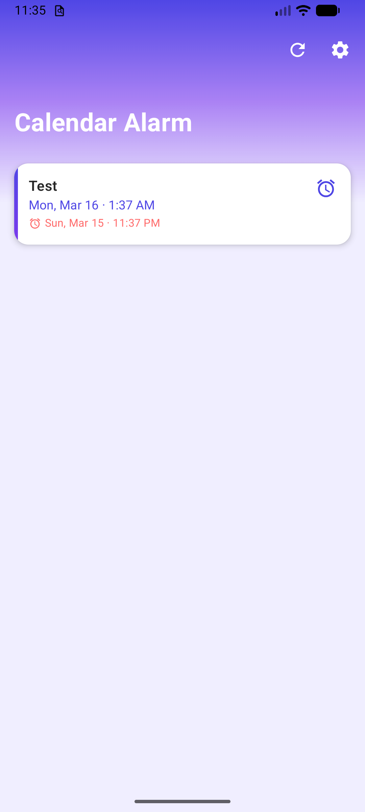
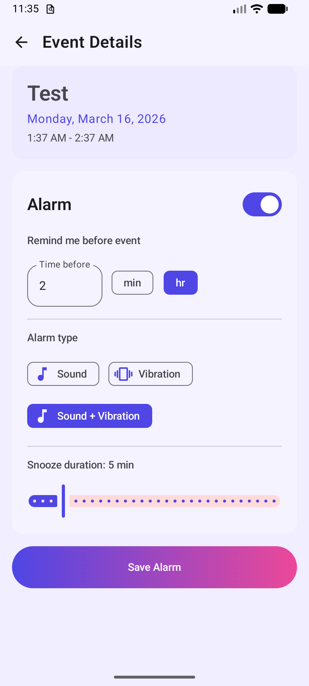
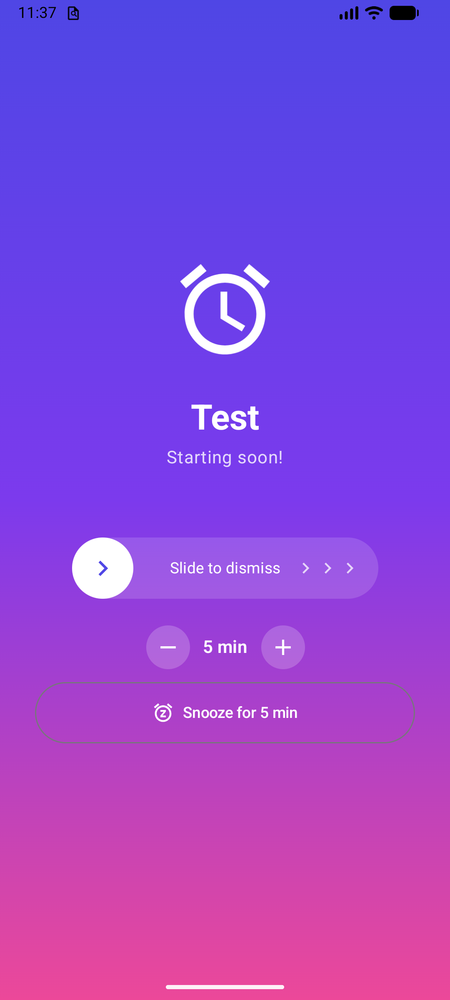
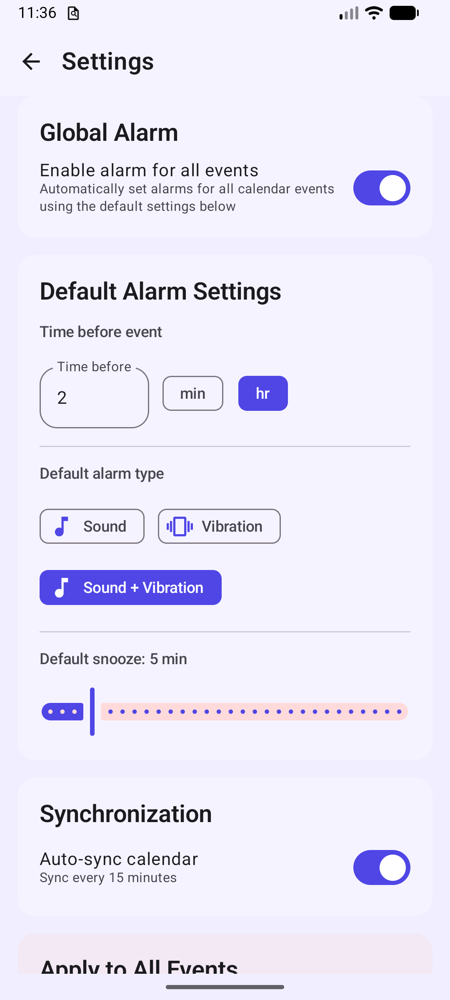
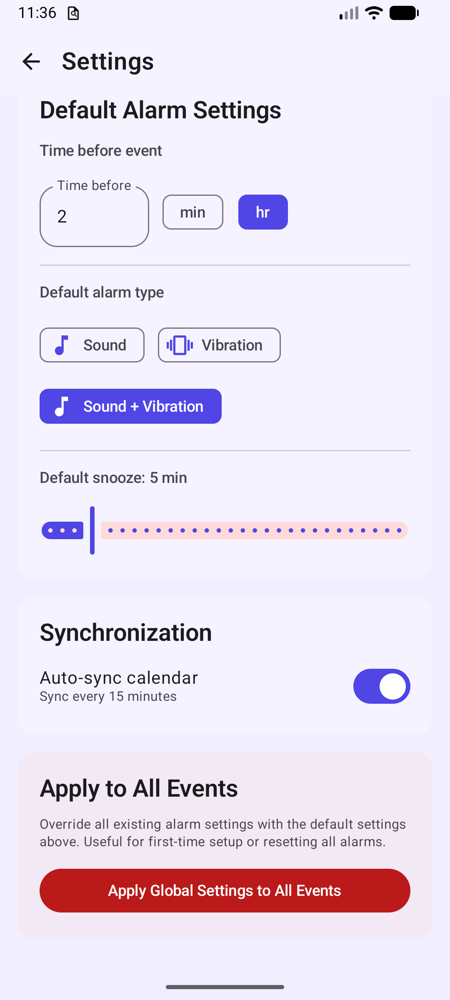

# Calendar Alarm

An Android app that turns your calendar events into real alarms you won't miss. Google Calendar's push notifications are easy to overlook — Calendar Alarm ensures you never miss an event by triggering a full alarm with sound, vibration, and gradual volume increase.

## Background

This is built entirely through AI-assisted development (vibe coding with Claude Code). My background is in data science and scientific computing (Python, SQL, R, MATLAB, and Fortran), with no prior experience in mobile development. This project served as both an experiment in AI-assisted development and a practical solution to a small problem in my daily life.

## Features

- **Calendar Integration** — Reads all upcoming events from your device's calendar (Google Calendar, Samsung Calendar, etc.), including recurring events
- **Configurable Alarm Timing** — Set alarms to fire any number of minutes or hours before an event starts
- **Persistent Alarms** — Alarms ring continuously until you slide to dismiss — no accidental taps
- **Snooze** — Adjustable snooze duration with +5/-5 minute controls, automatically capped before event start time
- **Sound, Vibration, or Both** — Choose between alarm sound, vibration, or sound + vibration combined
- **Gradual Volume** — Alarm volume ramps up gradually from quiet to loud over 30 seconds
- **Background Sync** — Automatically syncs with your calendar every 15 minutes to pick up new or changed events
- **Smart Re-activation** — Dismissed alarms automatically re-enable when an event is updated in Google Calendar
- **Global Settings** — Apply default alarm settings to all events at once, with per-event customization available
- **Holiday Exclusion** — Google holiday calendars are automatically excluded (no toggle needed)
- **Survives Reboots** — Alarms are re-scheduled after device restarts
- **Modern UI** — Built with Jetpack Compose and Material 3, with a vibrant gradient theme and dark mode support

## Screenshots

| Home | Event Detail | Alarm |
|:---:|:---:|:---:|
|  |  |  |

| Settings (Top) | Settings (Bottom) |
|:---:|:---:|
|  |  |

## Getting Started

### Prerequisites

- Android Studio Ladybug (2024.2) or later
- JDK 17+
- Android SDK 35
- An Android device or emulator running Android 8.0 (API 26) or later

### Build & Run

1. Clone the repository:
   ```bash
   git clone https://github.com/phykawing/CalendarAlarm.git
   cd CalendarAlarm
   ```

2. Open in Android Studio, or build from the command line:
   ```bash
   ./gradlew assembleDebug
   ```

3. Install on a connected device:
   ```bash
   ./gradlew installDebug
   ```

4. Build a release APK for distribution:
   ```bash
   ./gradlew assembleRelease
   ```
   The signed APK will be at `app/build/outputs/apk/release/app-release.apk`

### Permissions

The app requires the following permissions:

| Permission | Purpose |
|---|---|
| `READ_CALENDAR` | Read events from device calendar |
| `SCHEDULE_EXACT_ALARM` | Schedule precise alarm times (API 31-32) |
| `USE_EXACT_ALARM` | Schedule precise alarm times (API 33+) |
| `USE_FULL_SCREEN_INTENT` | Show alarm UI over lock screen |
| `SYSTEM_ALERT_WINDOW` | Launch alarm screen from background |
| `POST_NOTIFICATIONS` | Show alarm notifications (Android 13+) |
| `VIBRATE` | Vibration alarm mode |
| `RECEIVE_BOOT_COMPLETED` | Re-schedule alarms after reboot |
| `FOREGROUND_SERVICE` | Keep alarm ringing in the background |

## Architecture

```
app/src/main/java/com/phykawing/calendaralarm/
├── alarm/          # AlarmManager scheduling, BroadcastReceiver, foreground Service
├── data/           # Room database, DAOs, entities, ContentResolver calendar reader
├── di/             # Hilt dependency injection modules
├── domain/         # Domain models and use cases
├── navigation/     # Compose Navigation graph
├── sync/           # WorkManager periodic calendar sync
├── ui/             # Jetpack Compose screens, ViewModels, theme, components
└── util/           # Constants
```

**Tech stack:**
- Kotlin
- Jetpack Compose + Material 3
- Hilt (dependency injection)
- Room (local database)
- WorkManager (background sync)
- AlarmManager (exact alarm scheduling)
- Coroutines + Flow

**Pattern:** MVVM with Repository

## How It Works

1. On first launch, the app requests calendar, notification, exact alarm, overlay, and full-screen intent permissions.
2. It reads all upcoming events (including recurring events) from the device calendar, automatically excluding Google holiday calendars.
3. For any event, you can configure an alarm: set the lead time (e.g. "15 min before"), choose sound, vibration, or both, and enable it. Or use the global setting to enable alarms for all events at once.
4. The app schedules an exact alarm via `AlarmManager.setAlarmClock()`.
5. When the alarm fires, a full-screen activity appears (even from the background or lock screen) with sound that gradually increases in volume and/or vibration.
6. You can slide to dismiss the alarm or adjust and snooze it (+5/-5 min controls).
7. Dismissed alarms keep their settings (shown with a grey icon). If the event is updated in Google Calendar, the alarm is automatically re-enabled.
8. A background WorkManager job syncs your calendar every 15 minutes, picking up new, changed, or deleted events.

## Contributing

Contributions are welcome! Please:

1. Fork the repository
2. Create a feature branch (`git checkout -b feature/my-feature`)
3. Commit your changes
4. Push to the branch (`git push origin feature/my-feature`)
5. Open a Pull Request

## License

This project is open source. See [LICENSE](LICENSE) for details.
